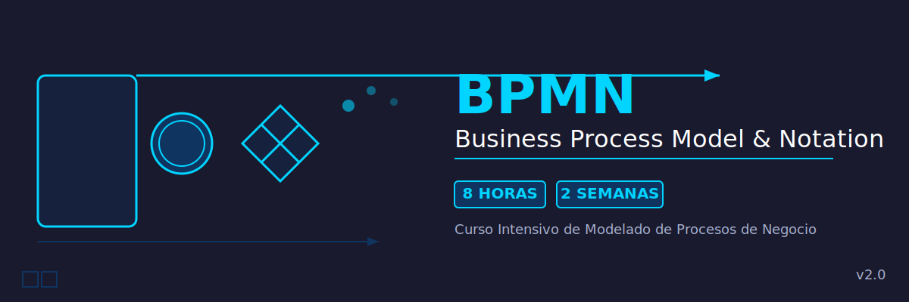

# 🔄 Curso Intensivo de BPMN

## Business Process Model and Notation

[](https://www.omg.org/bpmn/)
[-green>)](.)
[](.)
[](.)

---

## 📋 Descripción del Curso

Este curso intensivo de **BPMN (Business Process Model and Notation)** está diseñado para proporcionar una comprensión completa del estándar gráfico internacional para modelado de procesos de negocio a lo largo de **2 semanas**, con **una sesión de 4 horas por semana** (8 horas totales).

BPMN es un lenguaje visual que permite representar procesos de negocio de principio a fin, facilitando la comunicación entre analistas de negocio, desarrolladores técnicos y usuarios finales.

---

## 🎯 Objetivos de Aprendizaje

Al finalizar este curso, serás capaz de:

- ✅ Comprender los fundamentos y propósito de BPMN
- ✅ Identificar y utilizar los elementos básicos de la notación
- ✅ Crear diagramas de procesos de negocio efectivos
- ✅ Modelar flujos de trabajo complejos con precisión
- ✅ Aplicar mejores prácticas en el diseño de procesos
- ✅ Interpretar y analizar diagramas BPMN existentes

---

## 👥 Audiencia Objetivo

Este curso está dirigido a:

- Analistas de negocio
- Arquitectos de procesos
- Consultores de transformación digital
- Desarrolladores de software
- Project managers
- Cualquier profesional involucrado en el análisis y mejora de procesos

---

## ⏱️ Estructura del Curso (8 horas - 2 sesiones)

### 📅 **SEMANA 1 - Sesión 1** (4 horas)

#### **Módulo 1: Fundamentos de BPMN** (90 minutos)

- Introducción a BPMN y modelado de procesos
- Historia y evolución del estándar
- Casos de uso y beneficios
- Conceptos básicos de modelado
- Niveles de modelado y tipos de diagramas

#### **Módulo 2: Elementos Básicos** (150 minutos)

- Eventos: Inicio, Intermedio y Fin
- Actividades: Tareas y Subprocesos
- Compuertas: Decisiones y flujos paralelos
- Flujos de secuencia y conectores
- **Ejercicios prácticos** de elementos básicos

---

### 📅 **SEMANA 2 - Sesión 2** (4 horas)

#### **Módulo 3: Elementos Avanzados** (120 minutos)

- Pools y Lanes (organización)
- Artefactos y anotaciones
- Mensajes y colaboración entre procesos
- Eventos complejos y temporizadores
- Manejo de excepciones

#### **Módulo 4: Práctica y Casos Reales** (120 minutos)

- Ejercicios prácticos guiados
- Casos de estudio reales
- Mejores prácticas y errores comunes
- Herramientas de modelado
- Proyecto integrador final

---

## � Estructura del Repositorio

```
bc-bpmn/
├── README.md                                # ← Estás aquí
├── .gitignore                               # Configuración Git
├── _docs/                                   # Documentación complementaria
│   ├── RESUMEN-EJECUTIVO.md                # Vista general y métricas
│   ├── INVENTARIO-COMPLETO.md              # Catálogo de materiales
│   ├── CHEAT-SHEET.md                      # Guía rápida de referencia
│   ├── INDICE-NAVEGACION.md                # Navegación por temas
│   ├── GLOSARIO.md                         # Términos y definiciones
│   └── HERRAMIENTAS.md                     # Software recomendado
├── modulos/                                 # Contenido del curso
│   ├── sesion-1/                           # Primera semana
│   │   ├── modulo-1.1-introduccion-bpmn.md
│   │   └── modulo-1.2-elementos-basicos.md
│   └── sesion-2/                           # Segunda semana
│       ├── modulo-2.1-compuertas.md
│       ├── modulo-2.2-pools-lanes.md
│       ├── modulo-2.3-elementos-avanzados.md
│       └── modulo-2.4-practica-casos-reales.md
└── assets/                                  # Recursos gráficos
    ├── banner/                              # Banner del curso
    ├── diagramas/                           # Diagramas BPMN de referencia
    ├── ejemplos/                            # Ejemplos visuales
    └── referencias/                         # Material adicional
```

---

## 🚀 Cómo Usar Este Curso

### Antes de la Semana 1:

1. **Lectura previa**: Revisa `_docs/01-introduccion.md`
2. **Prepara entorno**: Instala una herramienta de diagramación (ver `_docs/05-herramientas.md`)

### Semana 1 (Sesión 1):

1. **Estudia**: Módulos 1 y 2 en `modulos/`
2. **Practica**: Ejercicios básicos de notación

### Entre Semana 1 y 2:

1. **Repasa**: Elementos básicos aprendidos
2. **Lee**: `_docs/03-elementos-avanzados.md`

### Semana 2 (Sesión 2):

1. **Estudia**: Módulos 3 y 4 en `modulos/`
2. **Proyecto**: Completa el caso integrador final

### Después del curso:

1. **Consulta**: Usa el glosario y referencias
2. **Practica**: Modela procesos de tu organización

---

## 📖 Documentación Adicional

La documentación complementaria está en el directorio `_docs/`:

- 📋 **[Resumen Ejecutivo](_docs/RESUMEN-EJECUTIVO.md)** - Vista general del curso con métricas y estado
- 📦 **[Inventario Completo](_docs/INVENTARIO-COMPLETO.md)** - Catálogo exhaustivo de todos los materiales
- 🔖 **[Cheat Sheet](_docs/CHEAT-SHEET.md)** - Guía rápida de referencia con toda la notación
- 🗺️ **[Índice de Navegación](_docs/INDICE-NAVEGACION.md)** - Navegación completa por temas
- 📚 **[Glosario](_docs/GLOSARIO.md)** - Definiciones y términos clave de BPMN
- 🛠️ **[Herramientas](_docs/HERRAMIENTAS.md)** - Software de modelado recomendado

---

## 🛠️ Prerrequisitos

- **Conocimientos**: No se requieren conocimientos previos
- **Software**: Cualquier herramienta de diagramación (recomendaciones en el módulo 4)
- **Actitud**: Mente abierta para pensar en procesos

---

## 📦 Recursos Adicionales

- [Especificación oficial BPMN 2.0](https://www.omg.org/spec/BPMN/2.0/)
- [BPMN Quick Guide](https://www.bpmn.org/)
- Herramientas recomendadas en `_docs/05-herramientas.md`

---

## 🤝 Contribuciones

Este material es de uso educativo. Si encuentras errores o tienes sugerencias:

1. Revisa la documentación existente
2. Propón mejoras con ejemplos claros
3. Mantén la coherencia con el estándar BPMN 2.0

---

## 📄 Licencia

Material educativo para uso interno de capacitación.

---

## 📧 Contacto

Para consultas sobre el curso, contacta al instructor durante la sesión o consulta los recursos adicionales proporcionados.

---

**¡Bienvenido al mundo del modelado de procesos de negocio! 🚀**

_Última actualización: 5 de noviembre de 2025_
