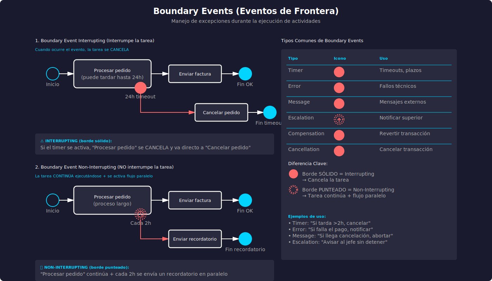

# Módulo 2.3: Elementos Avanzados y Manejo de Excepciones

**Duración**: 50 minutos  
**Sesión**: 2 (Segunda Semana)

---

## 🎯 Objetivos del Módulo

Al finalizar este módulo, serás capaz de:

- ✅ Comprender y usar eventos de frontera (Boundary Events)
- ✅ Manejar excepciones y errores en procesos
- ✅ Implementar compensación de transacciones
- ✅ Usar eventos de escalamiento y cancelación
- ✅ Modelar procesos robustos con manejo de excepciones

---

## 🎥 Video Tutorial

**Blinda Tu Proceso** - Manejo profesional de excepciones y boundary events

[](https://www.dropbox.com/scl/fi/3h7mxvai8ht4byhdku40w/2.3.Blinda_Tu_Proceso.mp4?rlkey=jlwrihutu93u0nx14oo5p21uq&st=r6uy2o1u&dl=0)

> 💡 **Recomendación**: Este video te enseñará a crear procesos robustos y resilientes mediante el uso correcto de boundary events, manejo de errores, timeouts, escalaciones y compensaciones.

---

## 📋 Contenido

### 1. Introducción al Manejo de Excepciones (5 min)

#### ¿Por qué manejar excepciones?

En el mundo real, los procesos no siempre fluyen según lo planeado. Pueden ocurrir:

- ❌ **Errores**: Fallas técnicas, datos inválidos
- ⏰ **Timeouts**: El proceso tarda demasiado
- 🚫 **Cancelaciones**: El usuario o sistema cancela
- ⚠️ **Situaciones excepcionales**: Eventos inesperados

**Sin manejo de excepciones**:

- Procesos se quedan "colgados"
- No hay claridad sobre qué hacer ante problemas
- Mala experiencia del usuario
- Pérdida de información

**Con manejo de excepciones**:

- Procesos resilientes y robustos
- Flujos alternativos claros
- Recuperación automática
- Mejor experiencia del usuario

---

### 2. Eventos de Frontera (Boundary Events) (15 min)

#### ¿Qué son los Boundary Events?

Los **Boundary Events** (eventos de frontera o límite) son eventos que se **adjuntan al borde de una actividad** y representan algo que puede ocurrir **mientras** la actividad se está ejecutando.

**Representación gráfica**: Círculo pequeño en el borde de una actividad 📋⭕

**Función**: Manejar situaciones excepcionales o alternativas durante la ejecución de una tarea.

**Diagrama de Referencia Visual**:



> 💡 El diagrama anterior muestra todos los tipos de boundary events (interruptores y no-interruptores) con ejemplos prácticos de cada uno.

#### Tipos de Boundary Events

Los Boundary Events pueden ser:

##### A) Interrupting (Interruptores) - Borde sólido

**Comportamiento**: Cuando el evento ocurre:

1. ⏹️ **Interrumpe** la actividad (la cancela)
2. ➡️ El flujo continúa por el camino del evento
3. ❌ La actividad NO se completa

**Símbolo**: Círculo con borde sólido

**Ejemplo Visual**:

```
┌──────────────────────────┐
│  (Procesar pedido)       │⭕⏰ Timeout 24h → (Cancelar pedido)
│                          │
└──────────────────────────┘
         ↓
    (Enviar factura)
```

Si ocurre el timeout, la tarea "Procesar pedido" se cancela y va directo a "Cancelar pedido".

##### B) Non-Interrupting (No interruptores) - Borde punteado

**Comportamiento**: Cuando el evento ocurre:

1. ✅ La actividad **continúa** ejecutándose
2. ➕ Se inicia un flujo **adicional** paralelo
3. ✔️ La actividad SÍ se puede completar

**Símbolo**: Círculo con borde punteado

**Ejemplo Visual**:

```
┌──────────────────────────┐
│  (Procesar pedido)       │⭕⏰ Cada hora → (Enviar recordatorio)
│                          │   (No interrumpe)
└──────────────────────────┘
         ↓
    (Enviar factura)
```

Cada hora se envía un recordatorio, pero "Procesar pedido" continúa hasta completarse.

#### Tipos Comunes de Boundary Events

| Tipo             | Símbolo | Interrupting | Non-Interrupting | Uso                     |
| ---------------- | ------- | ------------ | ---------------- | ----------------------- |
| **Timer**        | ⏰      | ✅           | ✅               | Timeouts, recordatorios |
| **Error**        | ⚡      | ✅           | ❌               | Errores técnicos        |
| **Message**      | ✉️      | ✅           | ✅               | Mensajes externos       |
| **Signal**       | 🔺      | ✅           | ✅               | Señales broadcast       |
| **Escalation**   | ⬆️      | ❌           | ✅               | Escalamiento a superior |
| **Compensation** | ↩️      | ❌           | ✅               | Revertir transacciones  |
| **Cancel**       | ❌      | ✅           | ❌               | Cancelar transacciones  |
| **Conditional**  | 📋      | ✅           | ✅               | Condiciones específicas |

---

### 3. Manejo de Errores (10 min)

#### Evento de Error (Error Event)

**Símbolo**: ⚡ Rayo

**Uso**: Capturar errores técnicos o de negocio.

**Características**:

- Siempre es **interrupting**
- Solo puede ser **catching** (captura)
- Se usa en Boundary Events o como Start Event de subprocess

#### Ejemplo: Proceso de Pago con Manejo de Error

```
[Inicio] → (Validar datos cliente)
              ↓
         (Procesar pago)
              │⭕⚡ Error de pago
              │    ↓
              │ (Notificar error)
              │    ↓
              │ (Registrar fallo)
              │    ↓
              │ [Fin: Pago fallido]
              ↓
         (Confirmar transacción)
              ↓
         (Enviar recibo)
              ↓
         [Fin: Pago exitoso]
```

**Explicación**:

- Si "Procesar pago" falla (error técnico de la pasarela)
- El error se captura en el Boundary Event
- Se ejecuta un flujo alternativo de manejo de error
- La tarea "Procesar pago" se interrumpe

#### Error End Event

Termina el proceso indicando que hubo un error.

```
(Validar datos)
    ↓
◇ ¿Datos válidos?
   ├─ Sí → (Continuar proceso) → [Fin exitoso]
   └─ No → (Registrar error) → ⚫⚡ [Fin: Error de validación]
```

---

### 4. Eventos de Timer (Temporizadores) (8 min)

#### Timer Boundary Event

**Símbolo**: ⏰ Reloj

**Uso**: Manejar timeouts o programar acciones repetitivas.

#### Ejemplo 1: Timeout con Interrupción

```
(Esperar aprobación del cliente)
         │⭕⏰ 48 horas
         │    ↓
         │ (Rechazar automáticamente)
         │    ↓
         │ [Fin: Timeout]
         ↓
    (Procesar aprobación)
         ↓
    [Fin: Aprobado]
```

**Explicación**:

- Si el cliente no responde en 48 horas
- Se rechaza automáticamente
- La espera se interrumpe

#### Ejemplo 2: Recordatorios sin Interrupción

```
(Revisar documento)
      │⭕⏰ Cada 24h (no interrumpe)
      │    ↓
      │ (Enviar recordatorio)
      │    (se ejecuta en paralelo)
      ↓
(Aprobar documento)
      ↓
[Fin]
```

**Explicación**:

- Cada 24 horas se envía un recordatorio
- La revisión continúa normalmente
- Es un flujo paralelo

#### Tipos de Timer

| Tipo         | Descripción           | Ejemplo                       |
| ------------ | --------------------- | ----------------------------- |
| **Duration** | Tiempo específico     | "P2D" = 2 días                |
| **Date**     | Fecha/hora específica | "2025-12-31T23:59:59"         |
| **Cycle**    | Repetitivo            | "R3/PT1H" = 3 veces cada hora |

---

### 5. Eventos de Escalamiento (Escalation Events) (7 min)

#### ¿Qué es el Escalamiento?

El **escalamiento** permite notificar a un **nivel superior** cuando algo requiere atención, **sin interrumpir** el proceso actual.

**Símbolo**: ⬆️ Flecha hacia arriba

**Características**:

- Siempre es **non-interrupting** (no interrumpe)
- Se usa para avisar a superiores
- El proceso original continúa

#### Ejemplo: Escalamiento por Monto Alto

```
┌─ Subproceso: Aprobar Gasto ────────────────────────┐
│                                                     │
│  (Revisar solicitud)                               │
│       ↓                                             │
│  ◇ ¿Monto > $10,000?                               │
│    ├─ No → (Aprobar) → [Fin Sub]                   │
│    └─ Sí → (Análisis detallado)                    │
│                 │⭕⬆️ Escalar a Gerente             │
│                 │    (no interrumpe)                │
│                 ↓                                   │
│           (Aprobar con condiciones)                │
│                 ↓                                   │
│           [Fin Sub]                                 │
└─────────────────────────────────────────────────────┘
                  │
                  ↓ (escalamiento)
           (Gerente revisa)
                  ↓
           (Toma nota)
                  ↓
              [Continúa]
```

**Explicación**:

- Si el monto es alto, se notifica al gerente
- El gerente puede revisar en paralelo
- La aprobación continúa su curso normal

---

### 6. Eventos de Compensación (Compensation Events) (8 min)

#### ¿Qué es la Compensación?

La **compensación** permite **revertir** acciones ya completadas cuando algo falla posteriormente.

**Símbolo**: ↩️ Flecha de retorno

**Uso típico**: Transacciones de negocios que necesitan deshacerse.

#### Concepto de Transacción en BPMN

Una **transacción** es un conjunto de actividades que deben completarse todas o ninguna.

**Ejemplo clásico**: Reserva de viaje

1. ✅ Reservar vuelo
2. ✅ Reservar hotel
3. ❌ Cargo rechazado → Necesita cancelar vuelo Y hotel

#### Ejemplo: Proceso de Reserva con Compensación

```
[Inicio] → (Reservar vuelo) ↩️ Compensación: (Cancelar vuelo)
              ↓
         (Reservar hotel) ↩️ Compensación: (Cancelar hotel)
              ↓
         (Procesar pago)
              │⭕⚡ Error de pago
              │    ↓
              │ ↩️⚫ [Compensar transacción]
              │    ↓
              │ (Ejecuta cancelaciones)
              │    ↓
              │ [Fin: Reserva cancelada]
              ↓
         (Enviar confirmación)
              ↓
         [Fin: Reserva confirmada]
```

**Explicación**:

1. Se reserva vuelo (con compensación asociada)
2. Se reserva hotel (con compensación asociada)
3. Si el pago falla:
   - Se lanza evento de compensación
   - Se ejecutan las compensaciones en **orden inverso**:
     1. Cancelar hotel
     2. Cancelar vuelo
4. Todo queda como al inicio

#### Reglas de Compensación

1. ✅ Solo se compensan actividades **ya completadas**
2. ✅ Se ejecutan en **orden inverso**
3. ✅ Cada actividad puede tener **su propia compensación**
4. ✅ Es **non-interrupting** por naturaleza

---

### 7. Eventos de Cancelación (Cancel Events) (5 min)

#### ¿Qué es la Cancelación?

Similar a la compensación, pero **cancela completamente** una transacción.

**Símbolo**: ❌ X

**Uso**: Solo dentro de transacciones.

#### Diferencia: Compensación vs Cancelación

| Aspecto          | Compensación         | Cancelación          |
| ---------------- | -------------------- | -------------------- |
| **Cuándo**       | Después de completar | Durante la ejecución |
| **Efecto**       | Revierte completadas | Cancela todo         |
| **Contexto**     | Cualquier proceso    | Solo transacciones   |
| **Interrupting** | No                   | Sí                   |

#### Ejemplo: Transacción con Cancelación

```
┌─ Transacción: Transferencia Bancaria ──────────────┐
│                                                     │
│  (Verificar fondos)                                │
│       ↓                                             │
│  ◇ ¿Fondos suficientes?                            │
│    ├─ No → ❌⚫ [Cancelar transacción]              │
│    └─ Sí → (Debitar cuenta origen)                 │
│                 ↓                                   │
│            (Acreditar cuenta destino)              │
│                 │⭕⚡ Error                          │
│                 │    ↓                              │
│                 │ ❌⚫ [Cancelar transacción]        │
│                 ↓                                   │
│            (Confirmar transferencia)               │
│                 ↓                                   │
│            [Fin: Exitoso]                           │
└─────────────────────────────────────────────────────┘
         │
         ↓ (si se cancela)
    (Revertir todo)
         ↓
    [Fin: Cancelado]
```

---

### 8. Subprocesos Especiales (7 min)

#### Event Sub-Process (Subproceso de Evento)

**Definición**: Subproceso que se **inicia por un evento** específico, no por flujo normal.

**Representación**: Subproceso con línea punteada.

**Uso**: Manejar situaciones excepcionales a nivel de proceso completo.

#### Ejemplo: Manejo Global de Errores

```
┌─ Proceso Principal ─────────────────────────────────┐
│                                                      │
│  [Inicio] → (Actividad 1) → (Actividad 2)          │
│               ↓                                      │
│          (Actividad 3) → [Fin]                      │
│                                                      │
│  ┌─ Event Sub-Process (línea punteada) ─────────┐  │
│  │ ⚡⭕ [Inicio: Error general]                   │  │
│  │     ↓                                          │  │
│  │ (Registrar en log)                             │  │
│  │     ↓                                          │  │
│  │ (Notificar administrador)                      │  │
│  │     ↓                                          │  │
│  │ (Limpiar recursos)                             │  │
│  │     ↓                                          │  │
│  │ ⚫ [Fin]                                        │  │
│  └─────────────────────────────────────────────────┘  │
│  (Se activa si ocurre error en cualquier parte)   │
└──────────────────────────────────────────────────────┘
```

**Explicación**:

- Si ocurre un error en CUALQUIER actividad del proceso
- Se activa automáticamente el Event Sub-Process
- Maneja el error de forma centralizada

#### Tipos de Event Sub-Process

| Evento Iniciador    | Interrupting | Uso               |
| ------------------- | ------------ | ----------------- |
| **Error** ⚡        | Sí           | Errores críticos  |
| **Escalation** ⬆️   | No           | Notificaciones    |
| **Message** ✉️      | Sí/No        | Mensajes externos |
| **Signal** 🔺       | Sí/No        | Señales broadcast |
| **Timer** ⏰        | Sí/No        | Timeouts globales |
| **Compensation** ↩️ | No           | Compensaciones    |

---

## 🧩 Ejercicio Práctico: Proceso Robusto (5 min)

### Escenario: "Procesamiento de Orden Online"

**Requisitos**:

1. El cliente realiza una orden
2. Se valida el pago (puede fallar)
3. Se prepara el envío (puede tardar más de 24h)
4. Si todo va bien, se envía
5. Si el pago falla → notificar y cancelar
6. Si tarda >24h → enviar recordatorio al almacén (sin cancelar)

**Tarea**: Diseña el proceso usando Boundary Events apropiados.

<details>
<summary>Ver solución sugerida</summary>

```
[Inicio: Orden recibida]
    ↓
(Validar orden)
    ↓
(Procesar pago)
    │⭕⚡ Error de pago
    │    ↓
    │ (Notificar cliente)
    │    ↓
    │ (Cancelar orden)
    │    ↓
    │ ⚫ [Fin: Pago fallido]
    ↓
(Preparar envío)
    │⭕⏰ 24h (no interrumpe)
    │    ↓
    │ (Enviar recordatorio a almacén)
    │    (continúa en paralelo)
    ↓
(Despachar producto)
    ↓
(Enviar tracking al cliente)
    ↓
⚫ [Fin: Orden enviada]
```

**Elementos usados**:

- Error Boundary Event (interrupting) para pago
- Timer Boundary Event (non-interrupting) para recordatorio
- Flujo alternativo para error

</details>

---

## 🎯 Mejores Prácticas

### Para Boundary Events

✅ **HACER**:

- Usar para excepciones, no para flujo normal
- Documentar claramente qué evento captura cada boundary
- Preferir non-interrupting para notificaciones
- Usar interrupting para errores críticos

❌ **EVITAR**:

- Demasiados boundary events en una actividad (máx 3-4)
- Boundary events para flujo de negocio normal (usar compuertas)
- Dejar eventos sin flujo de manejo

### Para Manejo de Errores

✅ **HACER**:

- Siempre tener un plan B para errores críticos
- Registrar errores para auditoría
- Notificar a usuarios/administradores
- Limpiar recursos al manejar errores

❌ **EVITAR**:

- Ignorar posibles errores
- Dejar el proceso "colgado" sin salida
- Errores genéricos (ser específico)

---

## 🔑 Conceptos Clave

| Concepto             | Descripción                | Símbolo        |
| -------------------- | -------------------------- | -------------- |
| **Boundary Event**   | Evento adjunto a actividad | ⭕ en borde    |
| **Interrupting**     | Cancela la actividad       | Borde sólido   |
| **Non-Interrupting** | Paralelo, no cancela       | Borde punteado |
| **Error**            | Fallas técnicas            | ⚡             |
| **Timer**            | Timeouts, repeticiones     | ⏰             |
| **Escalation**       | Notificar superior         | ⬆️             |
| **Compensation**     | Revertir completadas       | ↩️             |
| **Cancel**           | Cancelar transacción       | ❌             |

---

## 🎯 Checkpoint - Autoevaluación

1. ¿Cuál es la diferencia entre un Boundary Event interrupting y non-interrupting?
2. ¿Cuándo usar un Error Event vs un Timer Event?
3. ¿Qué es la compensación y cuándo se usa?
4. ¿Puede un Error Event ser non-interrupting?
5. ¿Para qué sirve un Event Sub-Process?

<details>
<summary>Ver respuestas</summary>

1. Interrupting cancela la actividad; non-interrupting crea flujo paralelo
2. Error para fallas; Timer para timeouts y programación
3. Compensación revierte acciones completadas cuando algo falla después; transacciones
4. No, Error Event siempre es interrupting
5. Para manejar situaciones excepcionales a nivel de todo el proceso

</details>

---

## ⏭️ Siguiente Módulo

**Módulo 2.4: Práctica Integrada y Casos Reales**

En el módulo final:

- Casos de estudio completos
- Mejores prácticas avanzadas
- Errores comunes y cómo evitarlos
- Proyecto integrador
- Herramientas de modelado

---

## 📚 Resumen Visual

```
Boundary Events:

    Interrupting              Non-Interrupting
    (Borde sólido)           (Borde punteado)

┌──────────────┐          ┌──────────────┐
│  Actividad   │⭕        │  Actividad   │⭕⭕
│              │           │              │
└──────────────┘          └──────────────┘
      ↓                         ↓ + ↓
  Cancela y                Paralelo, no
  va al evento             cancela
```

---

_Última actualización: Noviembre 2025_
